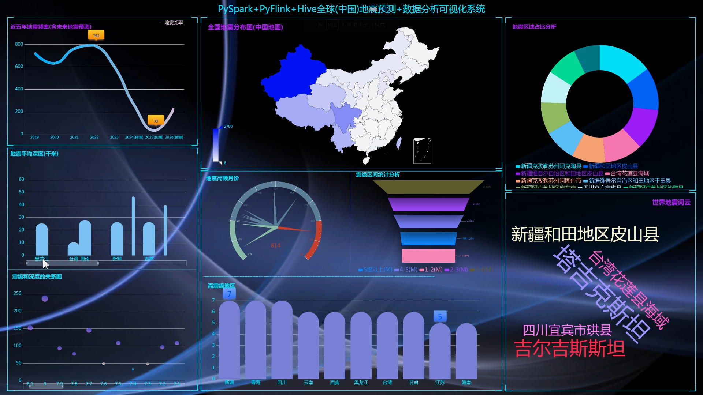
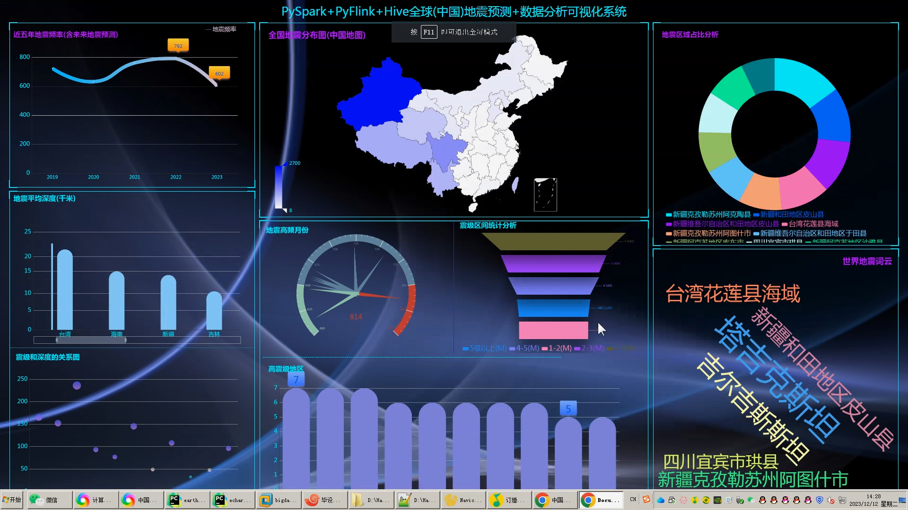
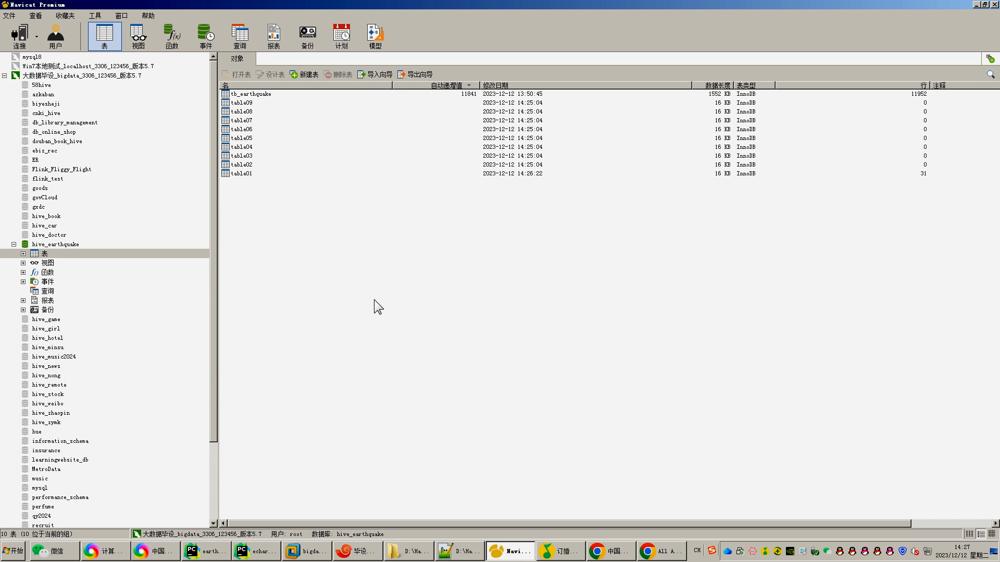
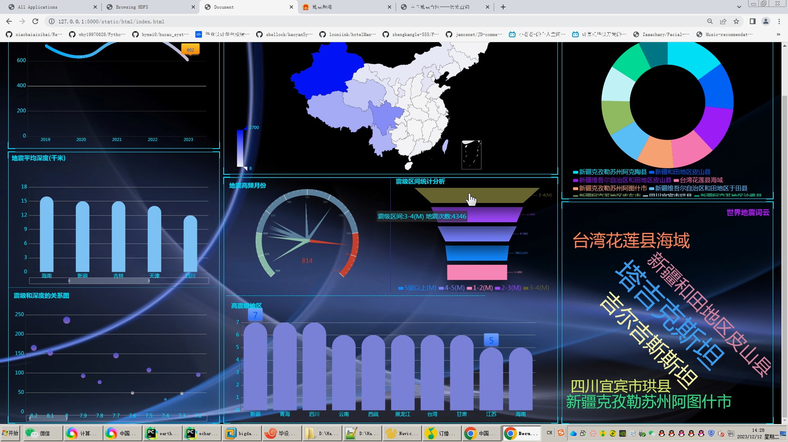
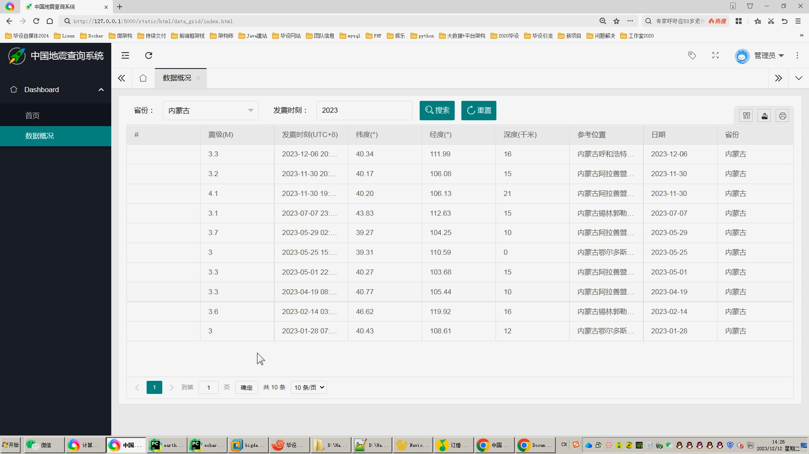
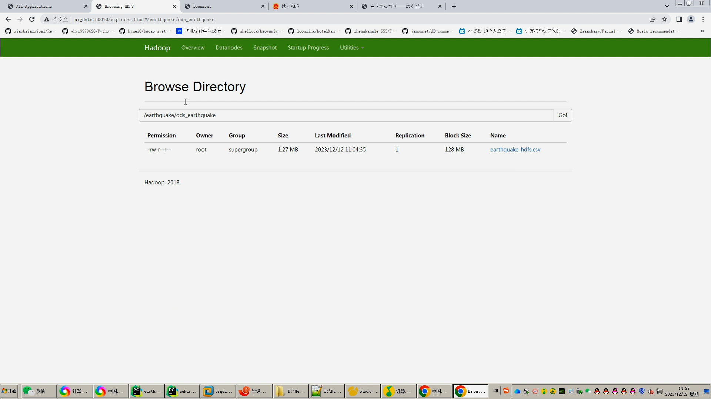
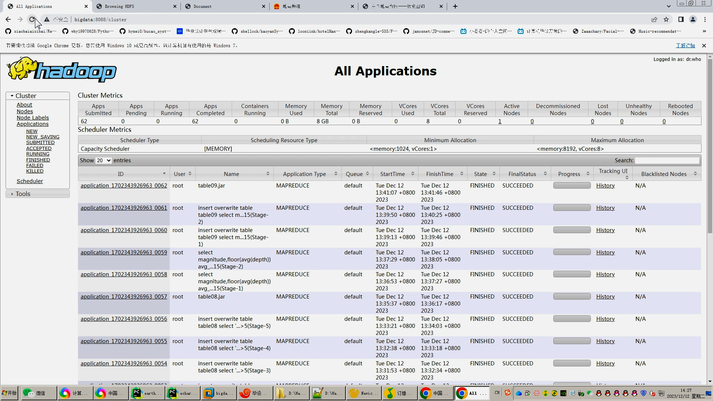
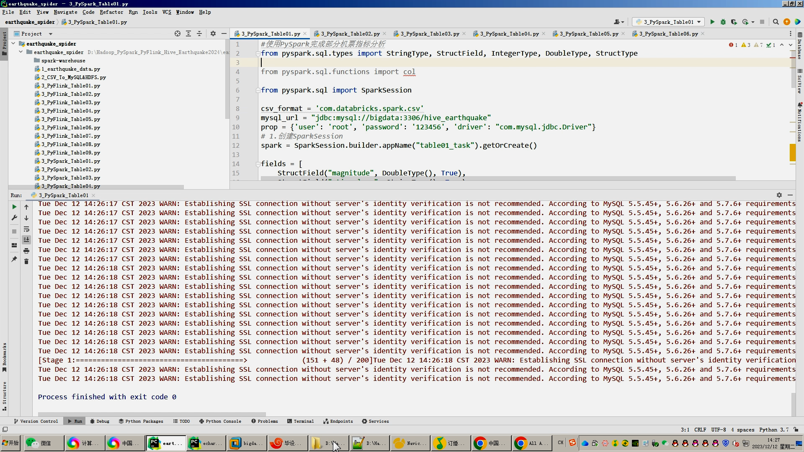

## 计算机毕业设计吊打导师PySpark+Hadoop+Hive+Flink地震预测系统 地震数据分析可视化 地震爬虫 大数据毕业设计 Flink Hadoop 深度学习 大数据毕业设计 知识图谱 大数据毕业设计 预测系统 实时计算 离线计算 数据仓库 人工智能 神经网络

## 要求
### 源码有偿！一套(论文 PPT 源码+sql脚本+教程)

### 
### 加好友前帮忙start一下，并备注github有偿地震预测分析
### 我的QQ号是2827724252或者798059319或者 1679232425或者微信:bysj2023nb或bysj1688

# 

### 加qq好友说明（被部分 网友整得心力交瘁）：
    1.加好友务必按照格式备注
    2.避免浪费各自的时间！
    3.当“客服”不容易，repo 主是体面人，不爆粗，性格好，文明人。

### 本系统B站视频演示链接：

1.采集中国地震局地震数据约100万条存入.csv和mysql,清洗后的.csv上传mysql;
3.分析指标离线可选用Hive,实时可选装PySpark/PyFlink,可三选一也可以只选一种或者三个都选；
4.计算结果使用sqoop工具对接到mysql数据库的指标表；
5.使用flask+echarts制作可视化大屏、layui查询表格；
6.使用卷积神经网络KNN CNN RNN对地震数据进行预测；
创新点：全新DrssionPage爬虫框架、可视化大屏、离线计算实时计算全部实现、深度学习算法预测地震

https://www.bilibili.com/video/BV1Cw411t7BT/?spm_id_from=333.999.0.0

https://www.bilibili.com/video/BV1wN411V7ab/?spm_id_from=333.999.0.0

https://www.bilibili.com/video/BV1Rp4y1Z7nk/?spm_id_from=333.999.0.0

https://www.bilibili.com/video/BV1Xe411C7hX/?spm_id_from=333.999.0.0

https://www.bilibili.com/video/BV1Fc411872e/?spm_id_from=333.999.0.0

https://www.bilibili.com/video/BV1je411U7w1/?spm_id_from=333.999.0.0

### 运行截图

